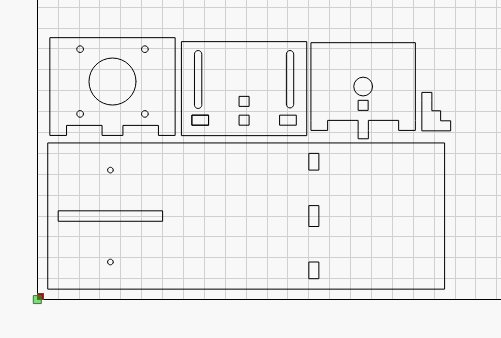
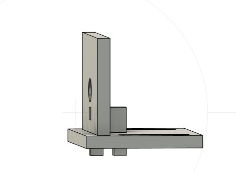
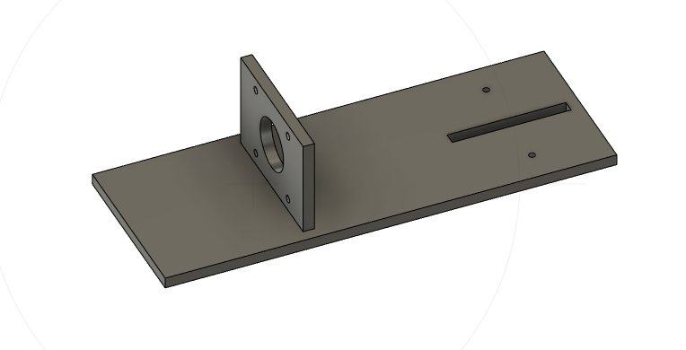
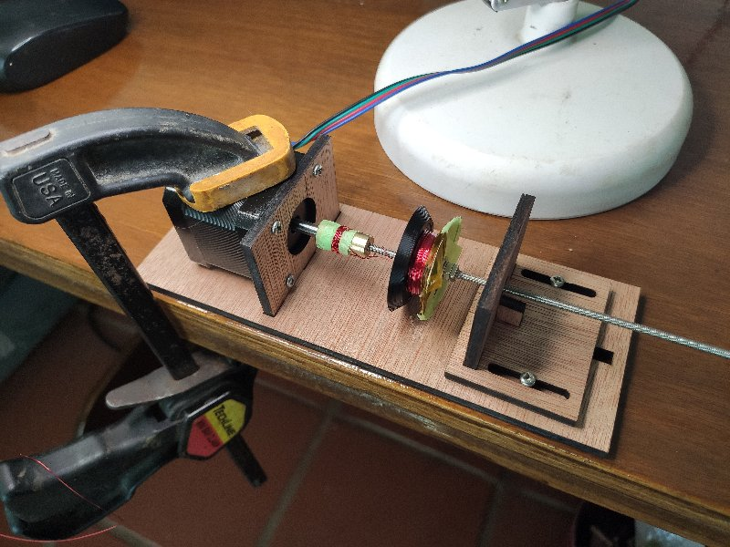
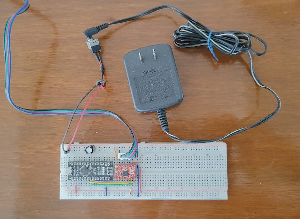
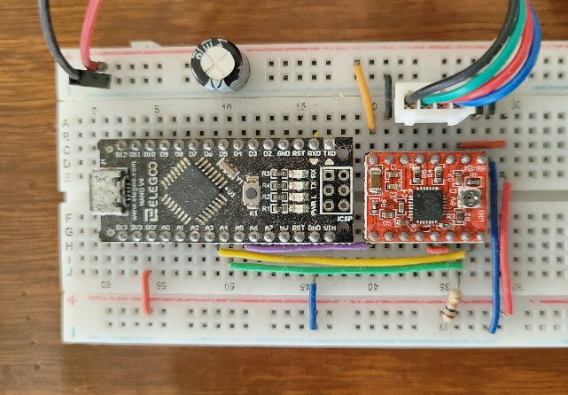

# Coil Winding Machine

This quick and dirty coil winding machine was made from
a few pieces of laser cut cheap 3/16" **plywood**, a **nema 17
stepper motor**, a 3-to-5 mm *brass adapter*, and a length
of **3 mm threaded rod**.

This repository contains the **Fusion 360** model and the
**DXF files** output from that, the **Lightburn** project
I used to cut the wood, and the **Arduino INO Sketch**
(program) that runs on an **Arduino Nano**.

The program allows one to **stop and start** and/or
**reverse** the motor, **count** the number of turns the motor has made,
and to program a certain number of **revolutions** to be performed.

## Assembly

1. Laser Cut the wooden parts.  I cut this 3/16" plywood in
2 passes at 95% power and 140mm per minute on my 10W diode laser cutter.

2. Glue the three pieces together that make the "sliding part" and
press a 3x9x4mm bearing into it.

3. Glue the two pieces together that make the "base" and attach
the **Nema 17 Stepper Motor** to the base with M3 machine screws.

4. Add the 3-to-5 mm **brass adapter** and 3 mm **threaded rod**
to it.  When in use the sliding part is screwed to the base
with two **M3 x 8 wood screws**.

The above photo shows the constructed machine in the process
of winding a coil.  I **clamp it** to my work surface and
feed the wire in by hand.

## Breadboard Circuit

The simple breadboard circuit consists of an **Arduino Nano**,
a red **A498 Stepper Motor Driver** module, a **10K resistor**,
a **100uf 50V electrolyte capacitor**, and a 4 pin **long header**
to provide a connector to the stepper motor cable.

I used a **12V DC Wall Wart** and a **barrel connector** to
provide 12V to the high power rail, and the **USB cable**
provides power to the Arduino (and a serial user interface)
from my **laptop**.

The above photo shows the 12V coming into into the high power
rail through the capacitor and connecting to the A498 module
at the two upper left pins.   The output of the module
goes directly to a connector to the 4 pin cable to the stepper
motor through the next four pins.  The last two top pins
are connected to 3.3V and Ground, respectively, from the Arduino
via the lower 5V rail.

The bottom row of the 8 pins on the module are as follows:

- Arduino pin **A4** is connected to **pin1** on the module via the purple wire to  to control the **direction** of the stepper motor
- pins 2,3, and 4, which set the micro-stepping rate of the controller are not connected
- pins 5 and 6 are connected together through the short orange wire
- Arduino pin **A5** is connected to **pin7** on the module via the yellow wire, with a 10K resitor to ground, to provide **step pulses**
- Arduino pin **A6** is connected to the **enable pin7** on the module via the green wire

## Software and User Interface

The **CoilWindingMachine.ino** program makes use of the small [**myDebug**](https:://gitub.com/phorton/Arduino-libraries-myDebug) library
to provide serial port output with formatting and requires the installation of the
Arduino **AccelStepper** library.

The program can be run from the Arduino Serial monitor or via Putty (better) to the **COM port** assigned to the Arduino.

The commands consist of a **single character**, possibly followed by a **number and carriage return**

The default  **revolutions** starts off as 10, the default **speed** is set to 200, and the count of **turns** starts as zero.

- Pressing the **space bar** while the motor is not running will cause it to begin doing the programmed number of **revolutions**.
- Pressing the **space bar** while the motor is turning will cause it to stop at the next full revolution
- Typing **Rnnn**, where "nnn" is a number, followed by a **return** will program the number of **revolutions**
- Typing **R-nnn**, (where "-nnn" is a negative number) will program it to turn in the negative direction for that number of revolutions.
- Typing **Tnnn**, where 'nnn' is a number, will set the **turn counter** to the given value
- Typing **Snnn**, where 'nnn' is a number, will set the **speed** to the given value.
- Typing **L** (while the motor is not running) will **lock** or **unlock** the motor so that it can or cannot be turned by hand

It can be handy to **lock and unlock** the motor when messing with the coil.

The speed of 1000 is about as fast as my little nema 17 motors will go, but I typically just leave
that at the default of 200.

The serial monitor shows the number of turns each 10 revolutions and when the motor stops.

Typically I use the default of 10 revolutions and press the **space bar**
to start the winding the wire around the (tape covered) brass connector.
**I have learned it is important to keep the wire from touching the metal
parts connected to the stepper motor** as it appears to cause spurious
turns and inconsistent behavior in the stepper motor if they touch.
So I cover the brass part with masking tape before I further use masking tape
to connect the *initial lead* of the coil to the brass part.

Then I insert the threaded rod and bobbin, attach the **sliding part**
and do a few more presses of the space bar to wind the first 10-20 turns on the coil.

When I am more confident, I type something like "R50<cr>" to begin winding
the coil 50 or more turns at a time.

Finally, when I am done winding as many turns as I want, I will **remove
the sliding part** and the threaded rod with the bobbon, type "R-10" to reverse
the direction, and press the **space bar** to unwind the inital leads from
the brass part.

I used this coil winder in the
[Clock 1&2](https://github.com/phorton1/theClock) and
[Clock 3](https://github.com/phorton1/theClock3) projects.
